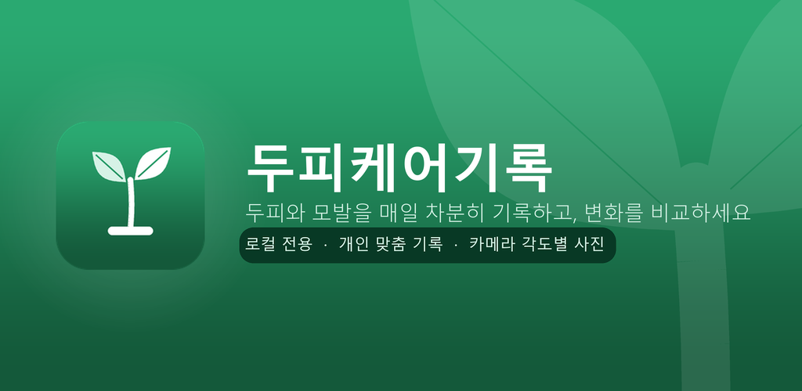

<div align="center">


# 두피케어기록 · Daddy Log

**두피와 모발의 변화를 차분히 기록하는 로컬 전용 Android 앱**

[](https://www.android.com/)
[](https://kotlinlang.org/)
[](docs/privacy.html)
[](store-graphics/play-console-current/)

</div>



두피케어기록은 40~50대 남성을 위한 두피·모발 관리 기록 앱입니다. 매일의 두피 상태, 각도별 사진, 케어 루틴을 기기 안에 조용히 모아 두고 시간에 따른 변화를 비교합니다. 모든 기록은 서버로 전송하지 않고 기기 내부에 보관하는 것을 기본 원칙으로 합니다.

| 항목 | 링크 |
| --- | --- |
| GitHub Pages | <https://jeiel85.github.io/daddy-log/> |
| 개인정보처리방침 | <https://jeiel85.github.io/daddy-log/privacy.html> |
| Play Console 그래픽 묶음 | [store-graphics/play-console-current](store-graphics/play-console-current/) |
| 앱 아이콘 512px | [store-graphics/icon-512.png](store-graphics/icon-512.png) |
| 기능 그래픽 1024x500 | [store-graphics/feature-graphic-1024x500.png](store-graphics/feature-graphic-1024x500.png) |

## 주요 기능

- **각도별 사진 기록** — 정면·정수리·측면 등 각도를 나눠 촬영하고 같은 각도의 사진을 시간순으로 비교
- **두피·모발 컨디션 기록** — 건조·가려움·비듬, 모발 상태에 더해 스트레스·수면·음주·운동까지 하루 단위로 기록
- **케어 루틴 체크** — 샴푸, 두피 토닉, 탈모약, 영양제, 두피 마사지, 병원 방문 등 나만의 루틴을 매일 체크
- **비교 · 통계** — 날짜별 기록과 사진을 나란히 놓고 컨디션·루틴 실천을 통계로 확인
- **PIN 잠금** — 4자리 보안 암호로 민감한 기록을 보호
- **로컬 전용 보관** — 광고 SDK·분석 SDK·서버 동기화 없이 기기 내부에만 저장

## 기술 스택

- Kotlin
- Jetpack Compose
- Material 3
- Room
- CameraX
- Coil

## 빌드

Android Studio에서 프로젝트를 열거나 로컬 Gradle 환경에서 다음 작업을 실행합니다.

```powershell
.\gradlew.bat :app:assembleDebug
```

릴리즈 번들은 로컬 `.keystore/release-signing.properties` 또는 환경 변수 `KEYSTORE_PATH`, `STORE_PASSWORD`, `KEY_PASSWORD`를 사용해 서명됩니다. `.keystore/`는 Git에서 제외되어 있으며, Play Console 업로드 키 백업용으로 로컬에만 보관합니다.

```powershell
.\gradlew.bat :app:bundleRelease
.\gradlew.bat :app:exportReleaseToDesktop
```

`exportReleaseToDesktop`는 `store-graphics/play-console-current/release-notes.txt`와 최신 AAB를 바탕화면 `Build` 폴더로 함께 내보냅니다. (내보내기 전 로케일별 500자 제한을 검증합니다.)

## 그래픽 자산 재생성

브랜드 그래픽은 코드로 생성하며, 다음 스크립트로 언제든 다시 만들 수 있습니다.

```powershell
python scripts/gen_icon.py      # 앱 아이콘 · 스토어 아이콘 · 파비콘
python scripts/gen_graphics.py  # 기능 그래픽 · OG 카드 · 랜딩 이미지
```

## 릴리즈 상태

- 패키지명: `com.jeiel.daddylog`
- 현재 버전: `1.0.0` (`versionCode` 1)
- 공개 랜딩: `docs/index.html`
- Play Console 현재 제출 묶음: `store-graphics/play-console-current/`

## 개인정보

두피케어기록은 광고 SDK, 분석 SDK, 서버 동기화, 클라우드 백업을 사용하지 않는 로컬 우선 앱입니다. 카메라 권한은 사용자가 직접 두피·모발 사진을 촬영할 때만 필요합니다.
